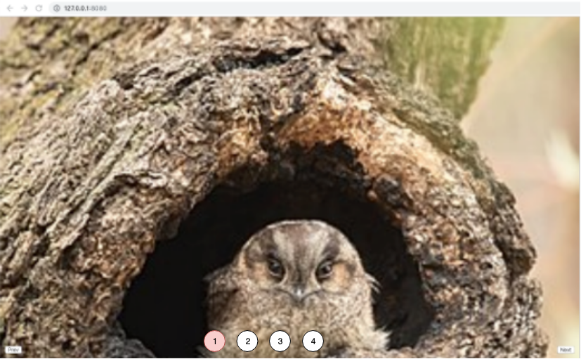

# Assignment 4

## Due Oct  16th before midnight

## Task

Starting with ``https://github.com/tejaswigowda/AME220Fall2019/blob/master/slideShow-JQ/index.html``, implement random access t slides.

That is:
1. Clicking on any slide number should take user to slide (10 pts)
2. If selected slide number is hi-lighted (2 pts extra).

## Mockup

## Hint

https://api.jquery.com/addClass/
